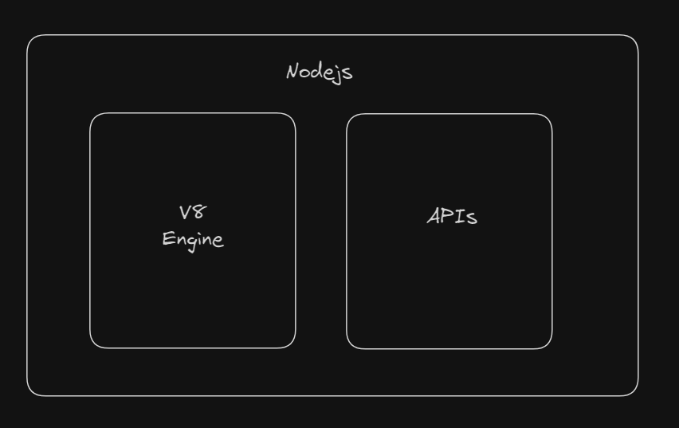

# Node.js on the server

- JavaScript can not only run on browser, but also can be used on server.
- Node.js is a JavaScript runtime built on Chrome's V8 JavaScript engine.
- The V8 engine is made with C++ program and can be embeded into any C++ program.

